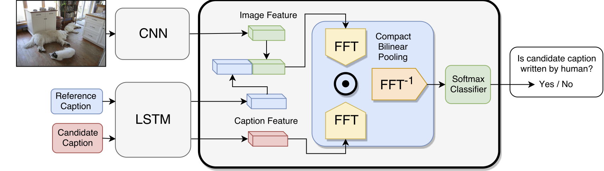
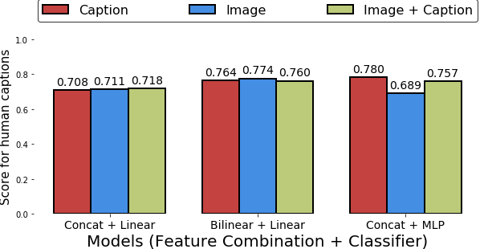
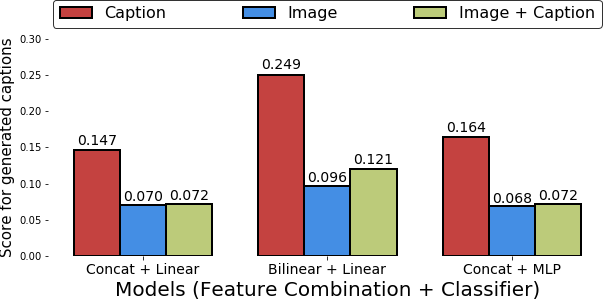
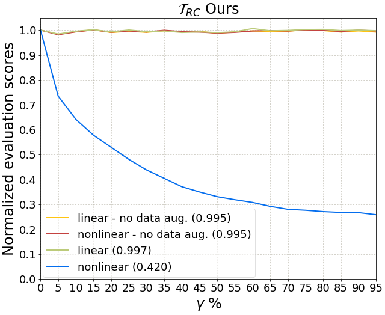
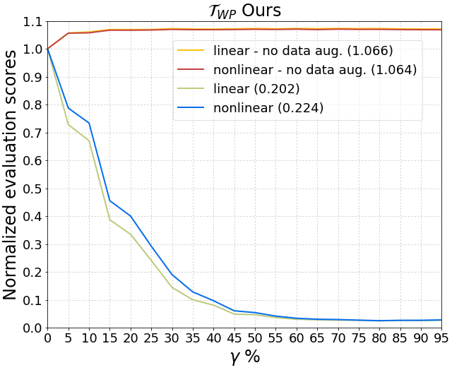
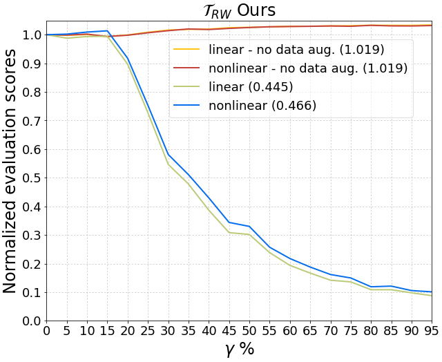
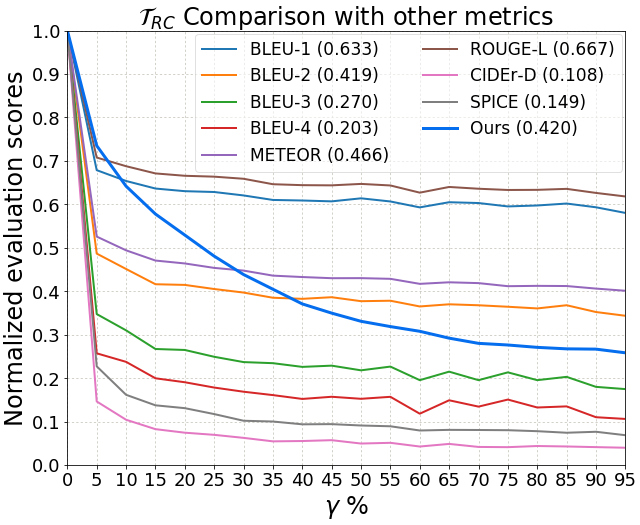
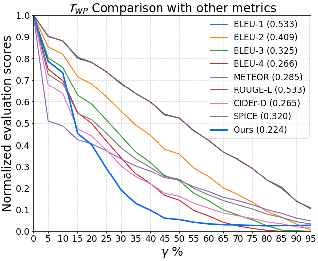
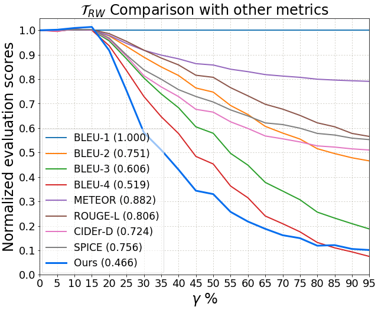

# CVPR 2018 Captioning Evaluation
TensorFlow implementation for paper [*Learning to Evaluate Image Captioning (CVPR 2018)*](https://vision.cornell.edu/se3/wp-content/uploads/2018/03/1501.pdf)

Authors: Yin Cui, Guandao Yang, Andreas Veit, Xun Huang, Serge Belongie


## Introduction

This repository contains a discriminator that could be trained to evaluate image captioning systems. The discriminator is trained to distinguish between machine generated captions and human written ones. During testing time, the trained discriminator take the image to be captioned, the reference caption, and the candidate caption. Its output probability of how likely the candidate caption is human written can be used to evaluate how well the candidate caption is. Please refer to the paper [[link]](https://vision.cornell.edu/se3/wp-content/uploads/2018/03/1501.pdf) for more detail.

<p align="center">
  
</p>


If you find our work helpful in your research, please cite it:
```latex
@conference{Cui2018CaptionEval,
title = {Learning to Evaluate Image Captioning},
author = {Yin Cui, Guandao Yang, Andreas Veit, Xun Huang, and Serge Belongie},
url = {https://vision.cornell.edu/se3/wp-content/uploads/2018/03/1501.pdf},
year = {2018},
date = {2018-06-18},
booktitle = {Computer Vision and Pattern Recognition (CVPR)},
address = {Salt Lake City, UT},
keywords = {}
}
```


## Dependencies

+ Python (2.7)
+ Tensorflow (>1.4)
+ OpenCV
+ PyTorch (for extracting ResNet image features.)
+ ProgressBar

## Preparation

1. Clone the dataset with recursive (include the bilinear pooling)
```bash
git clone --recursive https://github.com/richardaecn/cvpr18-caption-eval.git
```
2. Install dependencies. Please refer to TensorFlow, PyTorch, and OpenCV's official websites for installation guide. For other dependencies, please use the following:
```bash
pip install -r requirements.txt
```

3. Download data. This script will download data for both robustness and capability experiments, data created by Monte Carlo sampling, and Karpathy's split.
```bash
./download.sh
```

4. Extract image features. Following script will download ResNet checkpoint and use the checkpoint to extract the image features from MSCOCO dataset.
```bash
cd scripts/features/
./download.sh
python feature_extraction_coco.py --data-dir ../../data/ --coco-img-dir ../../data
```


## Running Experiments

1. Capability experiments
```bash
python discriminator_capability.py
```

2. Robustness experiments
```bash
python discriminator_robustness.py
```

## Results

To observe the result, please use the jupyter notebook ```plots.ipynb```.

1. Capability Experiment
<p align="center">
  
</p>
<p align="center">
  
</p>


2. Robustness Experiment
<p align="center">
  
  
  
 </p>
<p align="center">
  
  
  
</p>


## Evaluate a Model

To use our metric, first put the output captions of a model into following JSON format:

```json
{
    "<file-name-1>" : "<caption-1>",
    "<file-name-2>" : "<caption-2>",
    ...
    "<file-name-n>" : "<caption-n>",
}
```

Note that ```<caption-i>``` are caption represented in text, and the file name is the name for the file in the image. An example of such file can be found in ```examples/neuraltalk_all_captions.json```. Following command prepared the data so that it could be used for training:

```bash
python scripts/preparation/prep_submission.py --submission examples/neuraltalk_all_captions.json  --name neuraltalk
```

Note that we assume you've followed through the steps in the *Preparation* section before running this command. This script will create a folder `data/neuraltalk` and three ```.npy``` files that contain data needed for training the metric. Please use the following command to train the metric:

```bash
python score.py --name neuraltalk
```

The results will be logged in `model/neuraltalk_scoring` directory. If you use the default model architecture, the results will be in `model/neuraltalk_scoring/bilinear_img_1_512_0.txt`.
